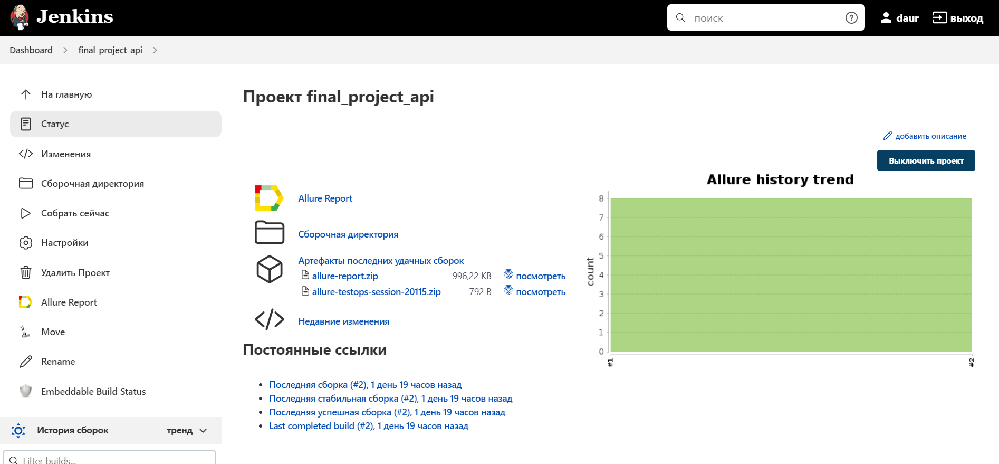
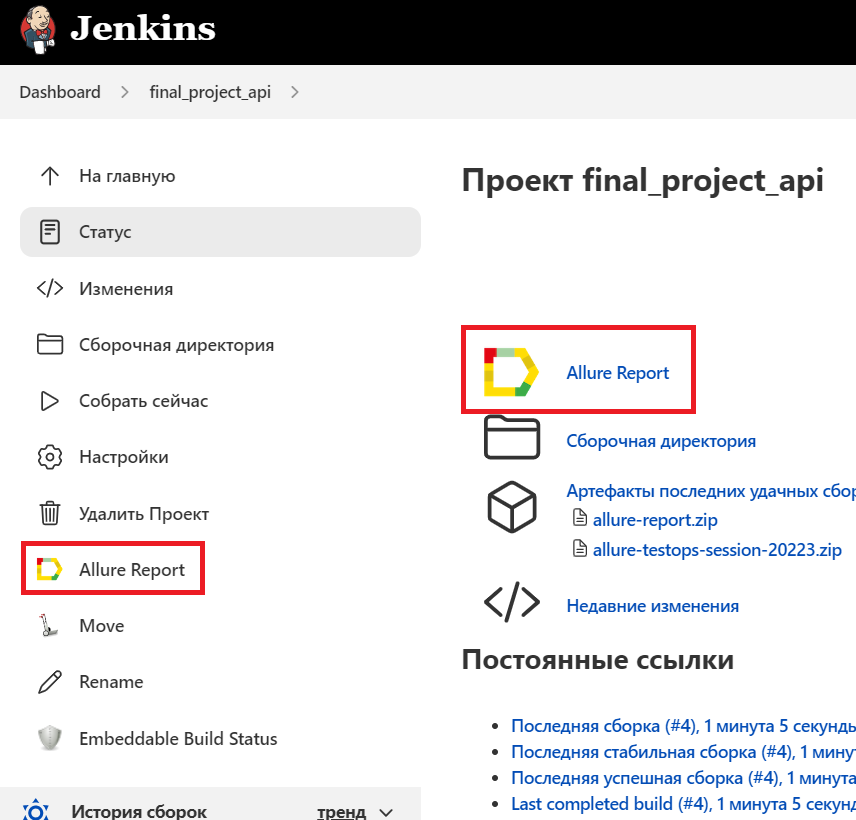
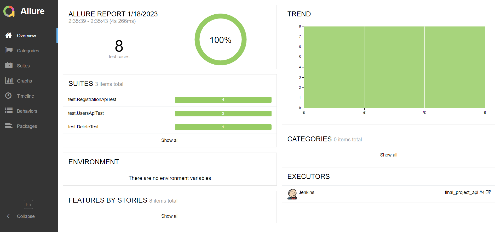
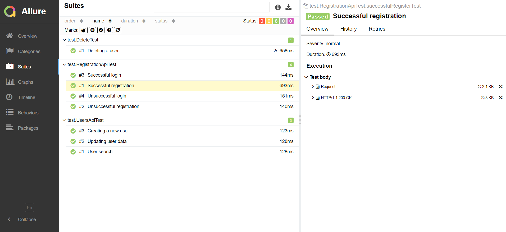
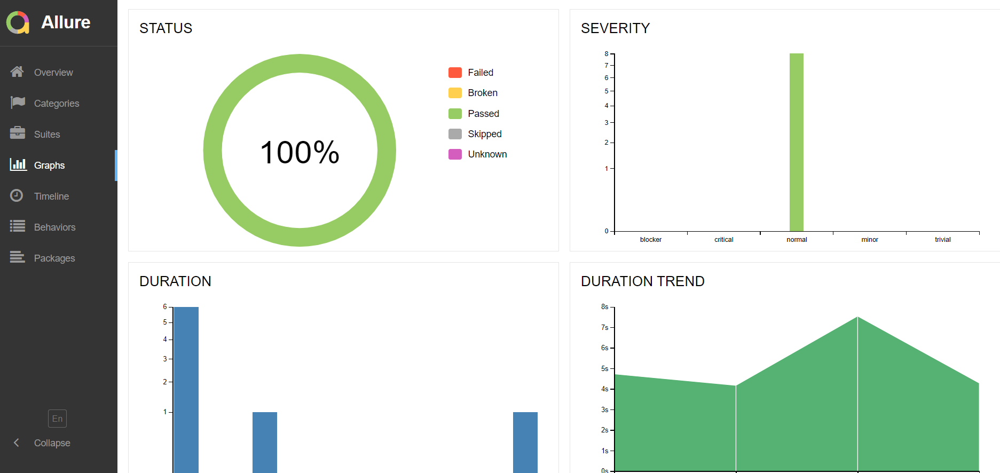
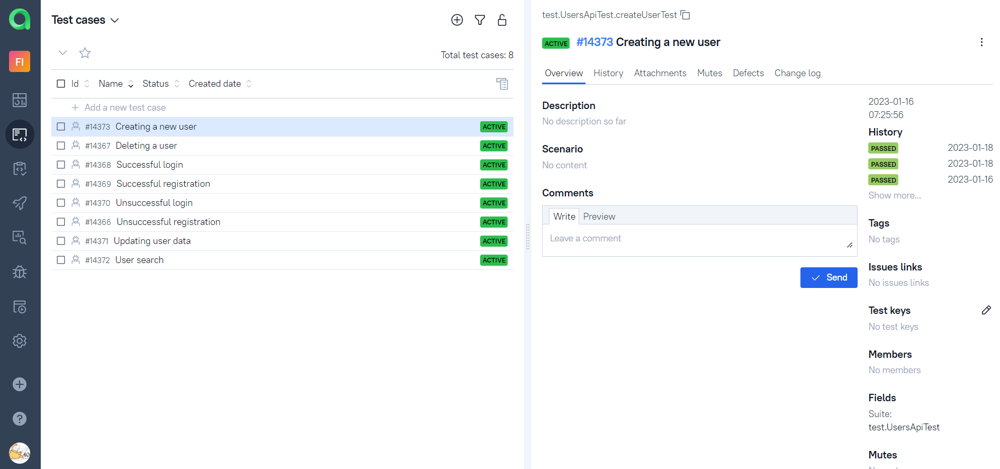
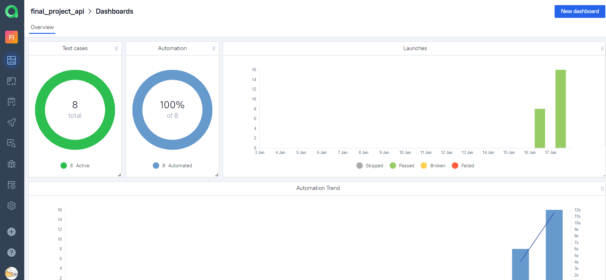
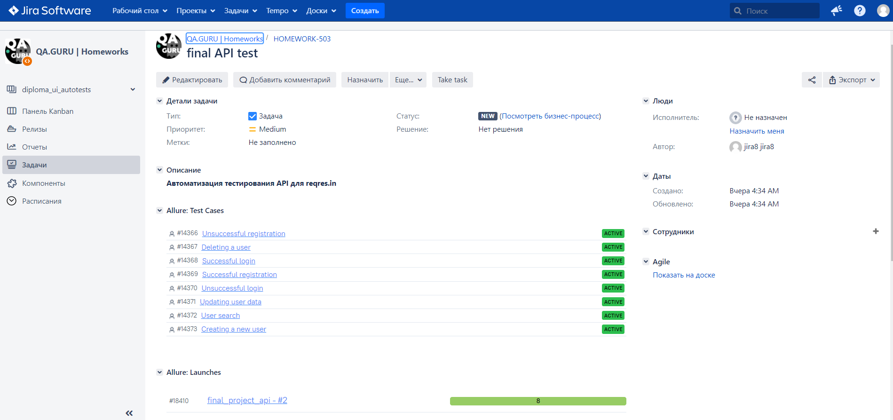
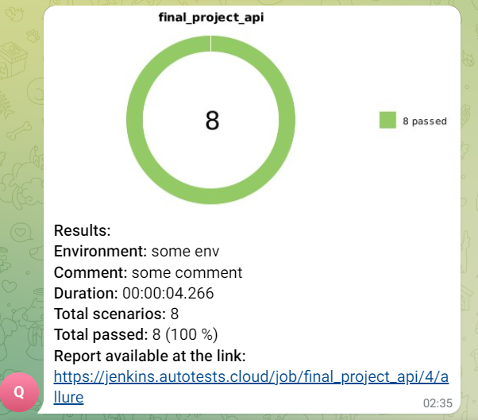

# Проект по автоматизации тестирования API для [reqres.in](https://reqres.in/)

## Содержание

- [Технологии и инструменты](#технологии-и-инструменты)
- [Реализованныe проверки](#реализованные-проверки)
- [Запуск тестов из терминала](#запуск-тестов-из-терминала)
- [Запуск тестов в Jenkins](#запуск-тестов-в-jenkins)
- [Отчет о результатах тестирования в Allure Report](#отчет-о-результатах-тестирования-в-Allure-report)
- [Интеграция с Allure TestOps](#интеграция-с-allure-testops)
- [Интеграция с Jira](#интеграция-с-jira)
- [Уведомления в Telegram с использованием бота](#уведомления-в-telegram-с-использованием-бота)

## Технологии и инструменты

<p  align="center">


</p>

## Реализованные проверки

- [x] *Успешная регистрация*
- [x] *Неуспешная регистрация*
- [x] *Успешная авторизация*
- [x] *Неуспешная авторизация*
- [x] *Создание нового пользователя*
- [x] *Обновление данных пользователя*
- [x] *Поиск пользователя*
- [x] *Удаление пользователя*

## Запуск тестов из терминала

```bash
gradle clean test
```

## Запуск тестов в [Jenkins](https://jenkins.autotests.cloud/job/final_project_api/)

#### Главная страница Jenkins

<p align="center">
  
</p>

Для запуска сборки необходимо нажать кнопку <code><strong>*Собрать сейчас*</strong></code>.

Результаты сборки можно посмотреть в Allure отчёте, кликнув на значок <code><strong>*Allure Report*</strong></code>.

#### Значок Allure Report

<p align="center">
  
</p>

## Отчет о результатах тестирования в [Allure Report](https://jenkins.autotests.cloud/job/final_project_api/allure/)

#### Главная страница Allure Report

<p align="center">
  
</p>

#### Тесты

<p align="center">
  
</p>

#### Графики

<p align="center">
  
</p>

## Интеграция с [Allure TestOps](https://allure.autotests.cloud/launch/18515)

#### Тест-кейсы

<p align="center">
  
</p>

#### Дашборды

<p align="center">
  
</p>

## Интеграция с [Jira](https://jira.autotests.cloud/browse/HOMEWORK-503)

#### Задача в Jira

<p align="center">
  
</p>

## Уведомления в Telegram с использованием бота

#### Оповещение о результатах сборки

<p align="center">
  
</p>
